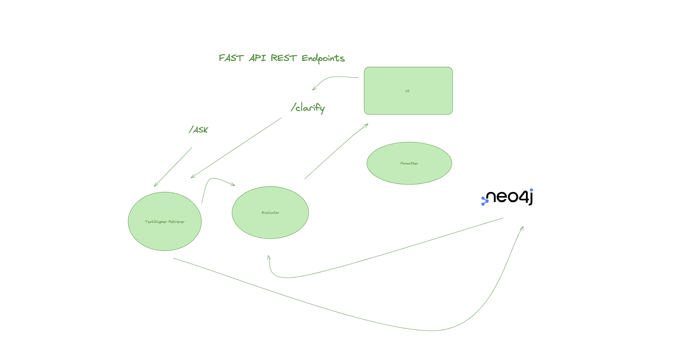

# 🏢 CBRE Neo4j Agentic RAG API

## 🧭 Retrieval Routing Overview
This diagram shows how the agent routes incoming questions to different retrieval strategies:


This project is a FastAPI-powered agentic RAG (retrieval-augmented generation) backend, built around the `neo4j-graphrag` library. It dynamically chooses between structured (`text2cypher`) and unstructured (`vector`, `vector_cypher`) retrieval strategies using LangGraph routing and LLM-based decisioning.

**Purpose**: Real estate knowledge graph for CBRE, enabling intelligent querying of property data, market insights, and industry knowledge.

---

## 🔧 Setup

### 1. Install dependencies (Poetry)
Make sure you're using Python 3.11 and have [Poetry](https://python-poetry.org/) installed.
```bash
poetry install
```

### 2. Configure environment
Create a `.env` file at the root with the following:
```env
NEO4J_URI=neo4j+s://<your-uri>
NEO4J_USER=neo4j
NEO4J_PASSWORD=<your-password>
NEO4J_DATABASE=neo4j
OPENAI_API_KEY=<your-api-key>
MODEL_NAME=gpt-4o
TEMPERATURE=0.0
TEXT_EMBEDDING_MODEL=text-embedding-3-large
```

---

## 🚀 Run Locally (Dev Script)
To start both the FastAPI backend and Streamlit frontend locally using Poetry:

```bash
chmod +x run_local.sh
./run_local.sh
```

- 🔧 Backend: [http://localhost:8000/docs](http://localhost:8000/docs)
- 🧠 Frontend: [http://localhost:8501](http://localhost:8501)

---

## 🐳 Run with Docker Compose
To run the backend and frontend in containers using Docker Compose:

```bash
docker compose up --build
```

- 🌐 Backend: [http://localhost:8000](http://localhost:8000)
- 🎛️ Frontend: [http://localhost:8501](http://localhost:8501)

---

## 🏢 CBRE-Specific Example Usage
Send a POST request to `/ask` with a real estate question:

```bash
POST /ask
Content-Type: application/json

{
  "question": "Show me office properties in downtown areas with vacancy rates below 10%"
}
```

The system will:
1. Use LangGraph to route the query to the appropriate retriever
2. Run either a Cypher query or a vector similarity search (or both)
3. Return structured results from the CBRE knowledge graph as JSON

---

## 📝 Managing Query Examples

The system uses external query examples stored in `query_examples.yml` to help the LLM generate better Cypher queries. These examples show the LLM how to convert natural language questions into proper Cypher queries.

### Adding New Examples

To add new query examples, edit the `query_examples.yml` file:

```yaml
query_examples:
  - input: "Show me all office properties in downtown areas"
    output: |
      MATCH (p:Property)
      WHERE p.property_type = 'Office' AND p.location CONTAINS 'downtown'
      RETURN p.name, p.address, p.property_type, p.location
      LIMIT 10
```

### Example Categories

The current examples cover:
- **Property Types**: Office, retail, industrial, residential
- **Financial Metrics**: Cap rates, rental rates, property values
- **Geographic Queries**: Location-based searches, downtown areas
- **Management**: CBRE-managed properties, tenant information
- **Market Data**: Vacancy rates, days on market, lease information
- **Amenities**: Parking, energy efficiency, maintenance
- **Time-based**: Recent activities, upcoming expirations

### Best Practices

1. **Use Real Schema**: Ensure examples match your actual Neo4j schema
2. **Variety**: Include different query patterns and complexity levels
3. **Domain-Specific**: Focus on real estate terminology and concepts
4. **Clear Patterns**: Show consistent naming conventions and relationships
5. **Error Prevention**: Include examples that avoid common Cypher pitfalls

### Customizing Examples

You can create different example files for different use cases:
- `query_examples_office.yml` - Office-specific queries
- `query_examples_retail.yml` - Retail-specific queries
- `query_examples_financial.yml` - Financial analysis queries

Then update the `Text2CypherRetrieverBuilder` to use your custom file:

```python
retriever = Text2CypherRetrieverBuilder(
    driver=driver,
    database=database,
    llm=llm,
    examples_file="query_examples_office.yml"
)
```

---

## 📊 CBRE Knowledge Graph Features
- **Property Data**: Office, retail, industrial, and residential properties
- **Market Analytics**: Vacancy rates, rental trends, cap rates
- **Geographic Data**: Neighborhoods, cities, regions
- **Industry Knowledge**: Real estate terms, regulations, market insights
- **Client Data**: Tenant information, lease terms, property management

---

## 📦 Deployment
This project is deployable via Docker, and can be extended for cloud deployment using GCP Cloud Run, AWS ECS, or other platforms. If you'd like help packaging or deploying this in production, let us know.
